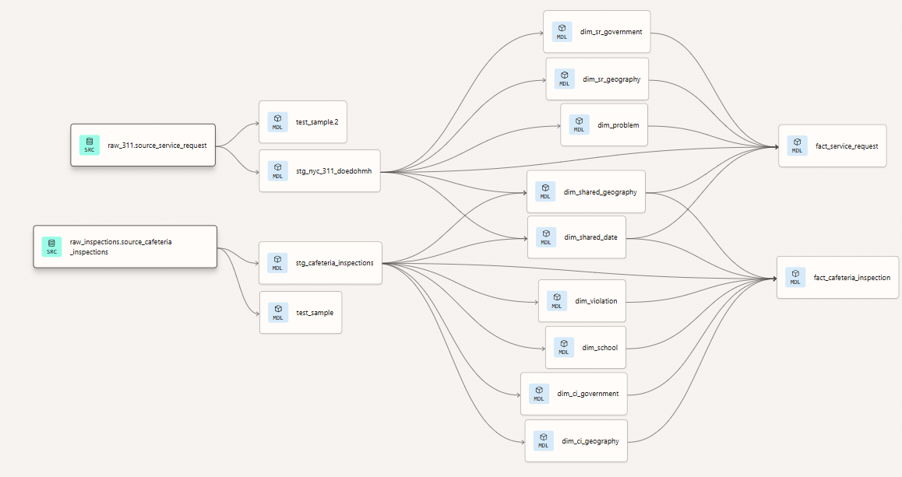

## Executive Summary
To provide operational oversight into New York City school conditions, I architected an end-to-end ELT pipeline integrating NYC 311 service requests and Department of Health (DOHMH) cafeteria inspection records. By designing a Kimball-style star schema and deploying automated data ingestion via Google Cloud Platform, I transformed disjointed public datasets into a unified analytical data bus. This infrastructure empowered stakeholders to move from reactive troubleshooting to proactive operational monitoring, identifying critical intersections between public complaints and health violations.

## Architecture & Technical Stack
* **Infrastructure:** Google Cloud Platform (BigQuery, Cloud Run, Cloud Scheduler)
* **Data Transformation (ELT):** dbt (data build tool), dbt_utils
* **Languages:** SQL, Python, YAML
* **Analytics & BI:** Data Studio, Socrata API

### Project Leadership & Execution
As the Group Technician, I took full ownership of the systems architecture. Navigating an entirely asynchronous team environment, I operated with high autonomy to establish the technical blueprints, scale the ELT pipeline code, and engineer the final Data Studio dashboards. This structure required strict self-management to ensure all deliverables scaled properly and met rigid project deadlines.

## The Implementation Workflow

### 1. Automated Data Ingestion (Python & Cloud Run)
I engineered Python-based extraction services deployed on Google Cloud Run to systematically ingest data from the Socrata API. To ensure pipeline resilience, the scripts dynamically managed offset pagination by querying existing BigQuery row counts and included automated schema-validation logic to dynamically update BigQuery tables if the source API introduced new fields.

### 2. Dimensional Modeling & Transformation (dbt)
Operating as the primary technical architect, I designed the staging, dimensional, and fact models using dbt. A significant challenge involved standardizing disparate string inputs and handling the lack of a universal school identifier across municipal agencies. I implemented rigorous normalization logic to ensure data integrity before it reached the analytical layer.

**Core Transformation Logic: Enforcing Data Integrity**
The following dbt snippet demonstrates the staging logic used to enforce standardization across high-variability fields, ensuring clean dimensional joins downstream:

```sql
-- Standardizing geography and enforcing data types in dbt
-- Borough normalization for cleaner dimensional joins
CASE
    WHEN UPPER(REGEXP_REPLACE(TRIM(CAST(borough AS STRING)), r'\s+', ' ')) IN ('MANHATTAN', 'NEW YORK COUNTY') THEN 'Manhattan'
    WHEN UPPER(REGEXP_REPLACE(TRIM(CAST(borough AS STRING)), r'\s+', ' ')) IN ('BRONX', 'THE BRONX') THEN 'Bronx'
    WHEN UPPER(REGEXP_REPLACE(TRIM(CAST(borough AS STRING)), r'\s+', ' ')) IN ('BROOKLYN', 'KINGS COUNTY') THEN 'Brooklyn'
    WHEN UPPER(REGEXP_REPLACE(TRIM(CAST(borough AS STRING)), r'\s+', ' ')) IN ('QUEENS', 'QUEEN', 'QUEENS COUNTY') THEN 'Queens'
    WHEN UPPER(REGEXP_REPLACE(TRIM(CAST(borough AS STRING)), r'\s+', ' ')) IN ('STATEN ISLAND', 'RICHMOND COUNTY') THEN 'Staten Island'
    WHEN NULLIF(REGEXP_REPLACE(TRIM(CAST(borough AS STRING)), r'\s+', ' '), '') IS NULL THEN NULL
    ELSE INITCAP(REGEXP_REPLACE(TRIM(CAST(borough AS STRING)), r'\s+', ' '))
END AS borough,

-- Zip code cleanup and preservation of leading zeros
CASE
    WHEN NULLIF(TRIM(CAST(zipcode AS STRING)), '') IS NULL THEN NULL
    WHEN REGEXP_CONTAINS(TRIM(CAST(zipcode AS STRING)), r'^\d{5}$') THEN TRIM(CAST(zipcode AS STRING))
    WHEN REGEXP_CONTAINS(TRIM(CAST(zipcode AS STRING)), r'^\d{5}-\d{4}$') THEN TRIM(CAST(zipcode AS STRING))
    ELSE NULL
END AS zip_code,
```

### 3. The Analytical Layer & Strategic Insights
To close the loop between data infrastructure and strategic operations, I constructed an interactive Data Studio dashboard directly connected to our BigQuery fact tables. During modeling, I identified the lack of a universal school identifier across the municipal datasets; consequently, I strategically architected the dashboard to track shared geographic and temporal dimensions rather than forcing inaccurate causal claims. 

The finalized dashboard successfully surfaced actionable operational insights, revealing that rodent-related issues constituted the largest share of school-related complaints (59.4%), and highlighting significant variance in resolution times across different boroughs.

<style>
.embed-responsive { position: relative; padding-bottom: 56.25%; height: 0; overflow: hidden; }
.embed-responsive iframe { position: absolute; top: 0; left: 0; width: 100%; height: 100%; border: 0; }
.embed-fallback { margin-bottom: .5rem; }
.embed-responsive:focus-within { outline: 3px solid #005fcc; outline-offset: 3px; border-radius: 4px; }
.load-btn { display: inline-block; margin: .5rem 0; padding: .5rem .75rem; background: #005fcc; color: #fff; border: none; border-radius: 4px; cursor: pointer; }
.load-btn:focus { outline: 3px solid #003a80; outline-offset: 3px; }
.diagram-responsive { position: relative; padding-bottom: 56.25%; height: 0; overflow: hidden; margin: 0.75rem 0; }
.diagram-responsive iframe { position: absolute; top: 0; left: 0; width: 100%; height: 100%; border: 0; }
</style>

<p class="embed-fallback">Explore the interactive Data Studio dashboard. If the preview does not load, open the full report in a new tab:</p>

<p class="embed-fallback"><a href="https://datastudio.google.com/reporting/af082ad1-36a9-452a-b6fd-66b5a8803dcc/page/f6lxF" target="_blank" rel="noopener">Open the Data Studio dashboard (new tab)</a></p>

<button id="load-dashboard" class="load-btn">Load Dashboard</button>

<div id="embed-container" class="embed-responsive" role="region" aria-label="NYC schools Data Studio dashboard" style="display:none;"></div>

<script>
(function(){
var btn = document.getElementById('load-dashboard');
var container = document.getElementById('embed-container');
var embedUrl = 'https://datastudio.google.com/embed/reporting/af082ad1-36a9-452a-b6fd-66b5a8803dcc/page/f6lxF';
function loadIframe(){
    if(container.querySelector('iframe')) return;
    var iframe = document.createElement('iframe');
    iframe.setAttribute('title','NYC Schools — Data Studio Dashboard');
    iframe.setAttribute('src', embedUrl);
    iframe.setAttribute('loading','lazy');
    iframe.setAttribute('allowfullscreen','');
    iframe.setAttribute('frameborder','0');
    container.style.display = 'block';
    container.appendChild(iframe);
    if(btn) btn.style.display = 'none';
}
if(btn){ btn.addEventListener('click', loadIframe); }
})();
</script>

<noscript>
<p>JavaScript is disabled — open the dashboard directly: <a href="https://datastudio.google.com/reporting/af082ad1-36a9-452a-b6fd-66b5a8803dcc/page/f6lxF" target="_blank" rel="noopener">Open Data Studio report</a></p>
</noscript>

## Technical Artifacts

### Entity-Relationship Diagram

<p>Final dimensional model utilized for the BigQuery warehouse, featuring conformed dimensions for cross-mart analysis.</p>

<div class="diagram-responsive">
<iframe src="https://dbdiagram.io/e/699b6979bd82f5fce27156b8/6a1f4d7ef15b4b04525cd922" title="Entity-Relationship diagram of the BigQuery warehouse model" loading="lazy"></iframe>
</div>

### Infrastructure Lineage

{fig-cap="Directed acyclic graph (DAG) mapping the automated transformation from raw sources to finalized fact and dimension tables." fig-alt="dbt lineage graph screenshot showing the data flow from raw source tables to finalized fact and dimension tables." width=85%}